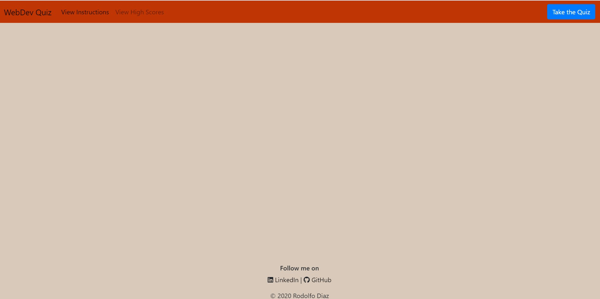
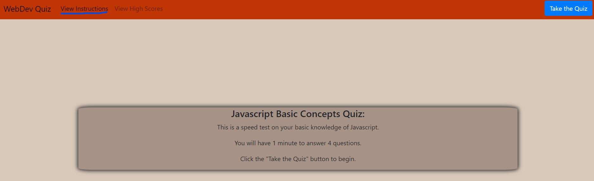
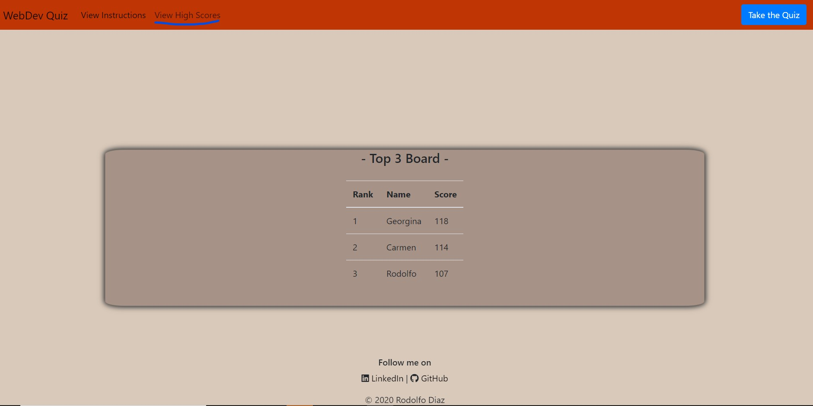
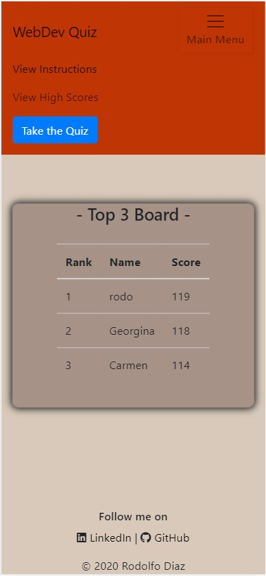
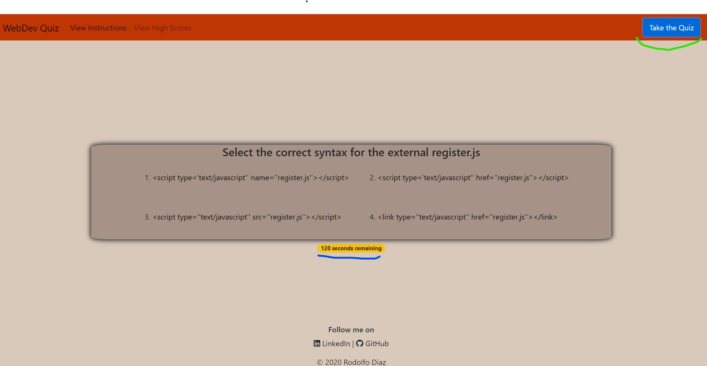
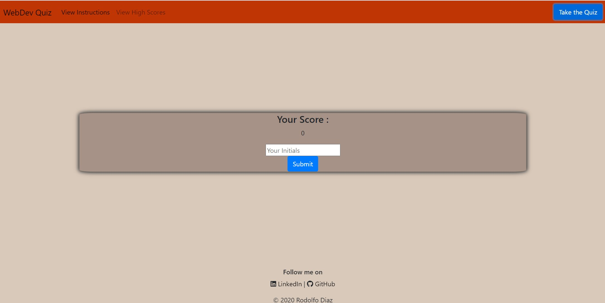
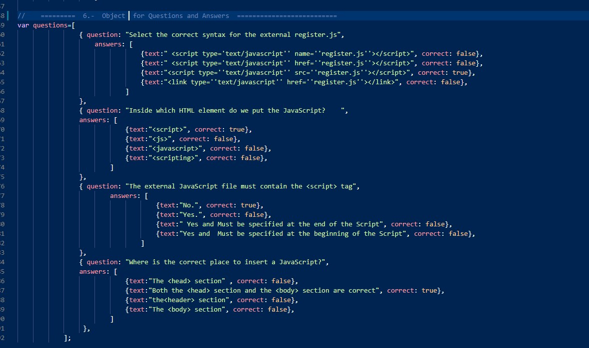
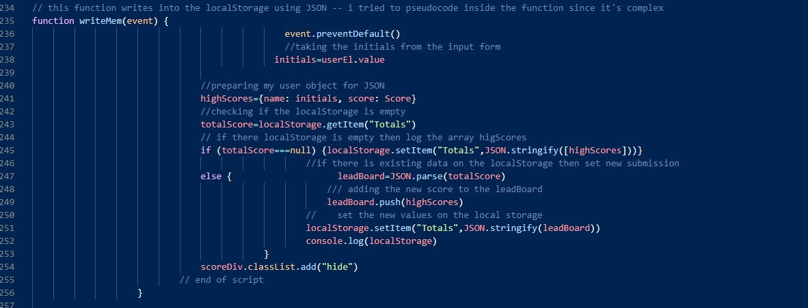

# Rodolfod1.Code-Quiz
========================================
## My Code Quiz 
### deployed application can be found at 
<https://rodolfod1.github.io/Code-Quiz/index.html>

## My approach to this project (web API):
- This code was designed to prompt to the user a series of questions with multiple choice answers. 
- Questions and answers are pulled from an object to make the question evaluation easier to understand. 
- Questions are displayed randomly every time the user clicks the "Take the Quiz" button.
- Screens showing the questions, the score submission and the leadBoard with the top 3 scores are dynamically generated,using the querySelector method for DOM manipulation.
- Scores are kept an object on the local storage; then they are parsed to an array for operations and manipulation.
- 12 Functions are deployed to carryout all the different user selections. 
- A set of loops, conditionals and 4 event listeners supports user interactivity.
- Bootstrap 4.0 was used for fast set up and management of cards tables and navbar 
- A simple but bold CSS was added and though on make it user neutral.     

## **  About the application **
* When the page loads:
  - The user is presented with a nav bar where it can select the options of reading instructions for the quiz, view the high scores , or take the quiz.
  - This app was developed with mobile first mind set, so the collapsed Nav bar will include a label for the main menu button. 

    - This is an example of the page when it loads 
    

    - When the user clicks on "View instructions" the following is displayed:
     

    - A Leaders Board view is available for the user to select by clicking on "View High Scores" label.
    

* Mobile first approach:
 - Responsive application using bootstrap 4.0
    - Here is an example of the top three high scores on an iPhone X:
    

* To run the application:
  - The user needs to click the "Take the Quiz" button.
    - The application will start displaying the questions and choices randomly so the user will have a different order every time they restart the quiz
    - A timer will start showing the seconds left .
    - 2 minutes are set on the timer. 
    - Every wrongly answered question will deduct 30 seconds out of the timer.
    - The quiz finishes when the user have gone thru all the questions or de timer is depleted. 

    - Here it is the example of the quiz and timer deployment:
    

* When the quiz ends:
  - Once any of the conditions, either the questions OR the timer are depleted the user is prompted with a form which includes the score and a submission input for the scores to be recorded for further usage on the leaders board.

    - Image of the submission form:
        

* Style:
- Html was designed using Bootstrap 4.0 and CSS designed simpler  to adapt a sober and bold style. 
 
 * About Javascript. 
  - Simple variables were used to gain efficiency on coding and debugging. 
  - Balance between global and local variables to facilitate and easier analysis and debugging.
  - Functions, LocalStorage, JSON , Objects and Events managers are deployed on this project. 
  - Questions and answers are arranged within an object for easier addition of elements 
  

    - Example of the questions object for easy addition of elements:
     I

    - Example of the localStorage management:
    

  *This Project contents:
  - Index.html - hosting the web page application all information is updated dynamically from the js file .
  - Script.js - Code for executing the app. 
  - style.css - simple style for the application.
  - README.md - this file.  
 

  =================================================================================
  ### How to best use this 
   - please fork and clone this repository 

 contact me at:
 https://github.com/Rodolfod1
 or direct email: rodolfodzr@gmail.com

 Rodolfo Diaz, Oct,04,2020
